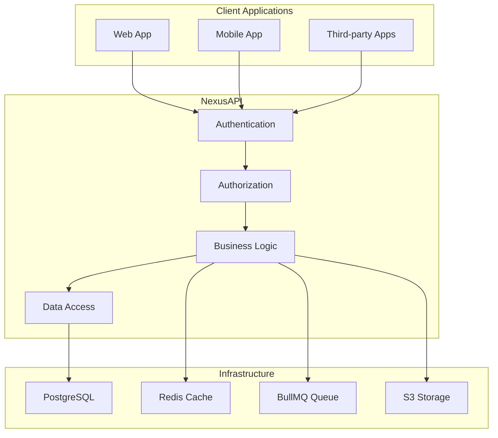

# 🚀 NexusAPI

### 🇹🇷 TANRI TÜRK'Ü KORUSUN VE YÜCELTSİN 🐺

## Enterprise-Grade NestJS Backend Foundation for Scalable SaaS

**Stop rebuilding infrastructure. Start shipping products.**

A production-ready, security-first, multi-tenant backend architecture built with **NestJS**, **Prisma**, and **PostgreSQL** — designed for real-world SaaS systems, not demos.

<br/>

[](https://nestjs.com/)
[](https://www.typescriptlang.org/)
[](https://www.postgresql.org/)
[](https://redis.io/)
[](https://www.docker.com/)
[](LICENSE)

**📖 [Documentation](./docs/README.md) • 🚀 [Installation](./docs/installation.md) • 📚 [API Docs](http://localhost:3000/docs) • 🐳 [Docker Hub](https://hub.docker.com/)**

<br/>

**⭐ Star us on GitHub! [github.com/MertcanMert/nexus-api](https://github.com/MertcanMert/nexus-api)**

---

## ✨ Quick Start

```bash
# Clone the repository
git clone https://github.com/MertcanMert/nexus-api.git
cd nexus-api

# Install dependencies
npm install

# Setup environment
cp .env.example .env
# Edit .env with your configuration

# Start the application
npm run start:dev

# Open API docs
open http://localhost:3000/docs
```

---

## 🎯 Who This Is For

NexusAPI is built for developers and teams who:

- Build **real SaaS products**, not side demos
- Need **multi-tenancy**, **RBAC / ABAC**, and **auditability**
- Care about **security, scalability, and clean architecture**
- Don't want to re-design the backend repeatedly

**Ideal users:** Startup founders, SaaS teams, agencies, senior/mid-level backend developers, freelancers delivering SaaS systems.

---

## 💎 The Problem

Backend development is costly because of **infrastructure complexity**, not business logic.

Teams lose weeks building:

- Authentication & token flows
- Authorization & ownership rules
- Tenant isolation
- Logging, auditing, monitoring
- Caching & background jobs
- Secure deployment setups

Many mistakes are only discovered in production.

---

## ✅ The Solution: NexusAPI

**Battle-tested backend foundation** that solves:

- Safe tenant isolation
- Prevention of data leaks
- Correct ownership & permission enforcement
- Production-level observability & audit logging

---

## 🔐 Enterprise-Grade Security

- Dual-token authentication (Access + Refresh)
- HttpOnly cookies (XSS protection)
- Rate limiting, Helmet, strict CORS
- ABAC authorization with CASL
- Full audit logging

No shortcuts, no “add later”.

---

## 🏢 SaaS & Multi-Tenancy

- Single-database / shared-schema architecture
- Automatic tenant filtering by Prisma Extensions
- Request-scoped tenant context (`nestjs-cls`)
- Tenant-aware authorization policies

Scales from **1 tenant to 10,000+**.

---

## ⚡ High-Performance Architecture

- PostgreSQL + Prisma
- Redis caching layer
- BullMQ background jobs
- Stateless API, Docker-native scaling

---

## 🧩 Clean, Maintainable Architecture

- Domain-oriented modules
- Clear layer separation (Controller → Service → Repository → Policy)
- Infrastructure abstraction (S3, Mail, Cache, Queue)
- Strict DTO validation

---

## 📚 Documentation

Includes:

- Architecture & project structure
- Authentication & authorization flows
- Multi-tenancy strategy
- Security hardening
- Caching & background jobs
- Logging & audit trails
- Deployment & scaling
- Error reference & troubleshooting
- Testing strategy
- API standards & versioning

---

## 🚀 Quick Start

```bash
npm install
docker-compose up -d
cp .env.example .env
npx prisma migrate dev
npm run start:dev
```

Swagger UI: [http://localhost:3000/docs](http://localhost:3000/docs)

📦 What You Get

- Full source code
- Complete documentation
- Production-ready configuration
- Docker-based development environment
- Clear extension points for product logic

🧠 What This Is NOT

- ❌ Tutorial project
- ❌ CRUD demo
- ❌ Beginner template

Professional backend foundation only.

## 📄 License

This project is licensed under the **MIT License** - see the [LICENSE](LICENSE) file for details.

### License Summary

- ✅ **Free to use** for personal and commercial projects
- ✅ **Modifiable** - You can modify the source code
- ✅ **Distributable** - You can distribute and sublicense
- ✅ **Private use** - No restrictions on private usage
- ⚠️ **No warranty** - Use at your own risk
- ⚠️ **No liability** - Authors are not liable

## 🏗️ Architecture Overview



### Technology Stack

- **Backend**: NestJS + TypeScript
- **Database**: PostgreSQL + Prisma ORM
- **Cache**: Redis (cache-manager + ioredis)
- **Queue**: BullMQ for background jobs
- **Auth**: JWT (dual-token system)
- **Storage**: AWS S3 / Local storage
- **Security**: Helmet, bcrypt, rate limiting
- **Testing**: Jest with comprehensive coverage

---

## 📊 Performance & Security

### 🚀 Performance

- **Response Time**: 50-200ms (simple endpoints)
- **Throughput**: ~1200 RPS (optimized)
- **Cache Hit Rate**: 70-80%
- **Memory Usage**: ~200MB baseline

### 🔐 Security Features

- ✅ Multi-tenant data isolation
- ✅ JWT dual-token authentication
- ✅ Role-based access control (RBAC)
- ✅ Advanced rate limiting
- ✅ Input validation & sanitization
- ✅ Security headers (CSP, HSTS)
- ✅ Comprehensive audit logging

---

## 📚 Documentation

- 📖 [Documentation Index](./docs/README.md) - Complete documentation
- 🚀 [Installation Guide](./docs/installation.md) - Step-by-step setup
- 🔐 [Security Guide](./docs/SECURITY-HARDENING.md) - Security hardening
- ⚡ [Performance Guide](./docs/PERFORMANCE.md) - Performance optimization
- 🚀 [Deployment Guide](./docs/deployment.md) - Production deployment
- 📚 [API Documentation](http://localhost:3000/docs) - Interactive API docs

---

## 🛣️ Version 2.0 Roadmap

We're actively working on NexusAPI 2.0 with exciting new features:

### Planned Features 🚧

- [ ] **Microservices Architecture** - Scalable service-based design
- [ ] **GraphQL Support** - Flexible query language
- [ ] **Real-time Notifications** - WebSocket integration
- [ ] **Advanced Analytics** - Built-in analytics dashboard
- [ ] **AI Integration** - ML-powered features
- [ ] **Enhanced Monitoring** - OpenTelemetry support

### 🔄 Upgrade Path

We're committed to smooth upgrades from v1.x to v2.0. See our [V2 Roadmap](./docs/V2-ROADMAP.md) for details.

---

## 🤝 Contributing

We welcome contributions! See our [Contributing Guide](./CONTRIBUTING.md) for details.

### Quick Development Setup

```bash
# Fork and clone
git clone https://github.com/your-username/nexus-api.git
cd nexus-api

# Install and run
npm install
npm run start:dev

# Run tests
npm run test
npm run lint
```

---

## 📈 Project Status

🟢 **Active Development** • 🐛 **Issues Welcome** • 💬 **Community Support** • ⭐ **Growing Ecosystem**

### 🏆 Recent Achievements

- ✅ Critical security vulnerabilities fixed
- ✅ Performance optimizations completed
- ✅ Comprehensive documentation added
- ✅ Production-ready security implementation
- ✅ Enterprise-grade performance optimizations

---

## 🆘 Support & Community

- 📖 [Documentation](./docs/README.md)
- 🐛 [Issues](https://github.com/MertcanMert/nexus-api/issues)
- 💬 [Discussions](https://github.com/MertcanMert/nexus-api/discussions)
- 📧 Email: mertcan@armert.com.tr

---

🏁 Final Word

Start from a solid foundation. Focus on your product — not backend plumbing.

<div align="center"> <sub>Built with ❤️ using NestJS by
