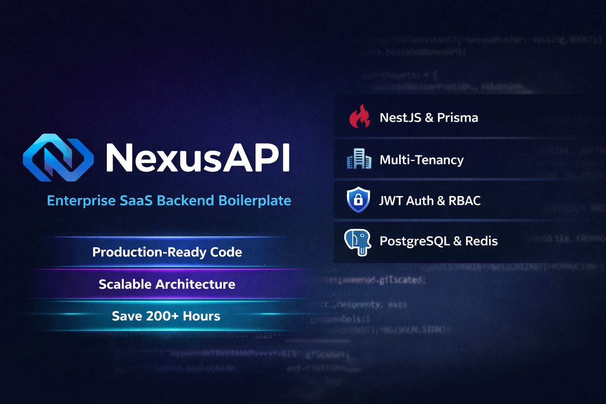
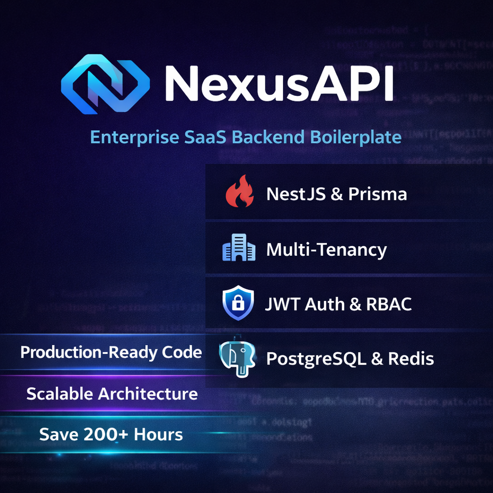
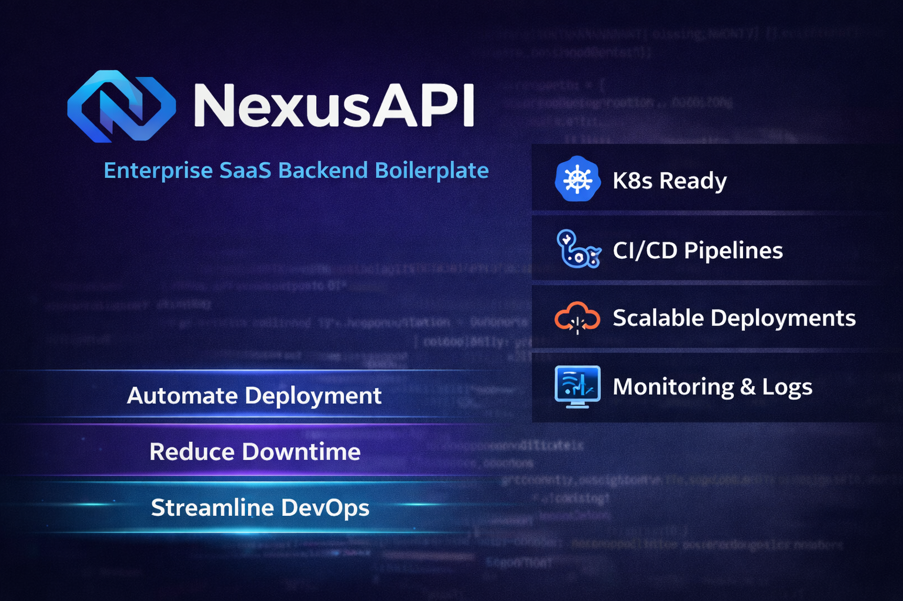
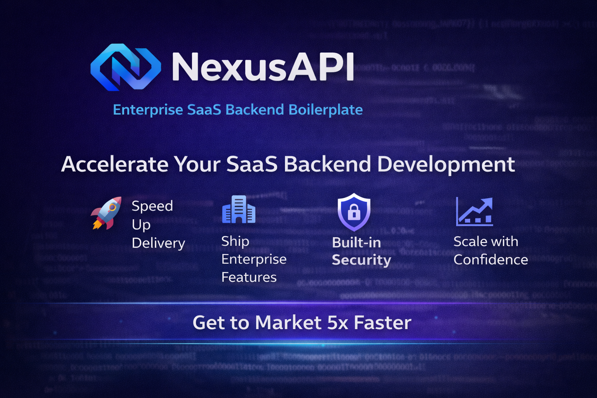
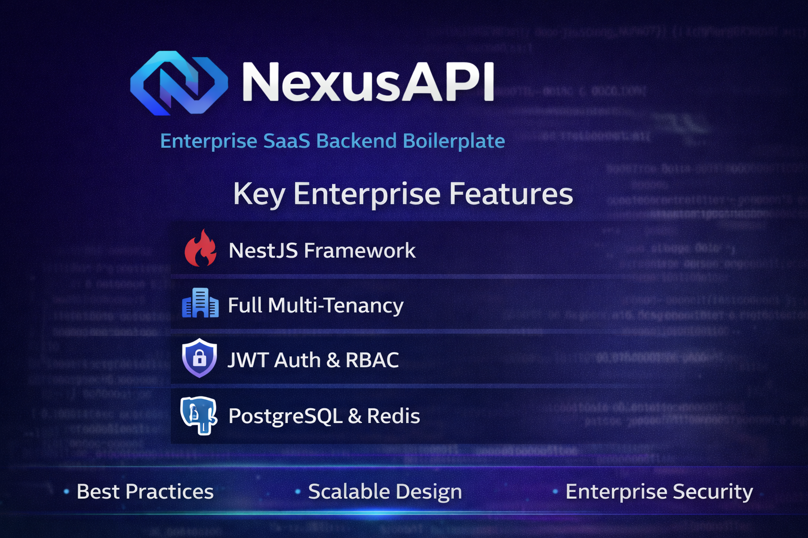
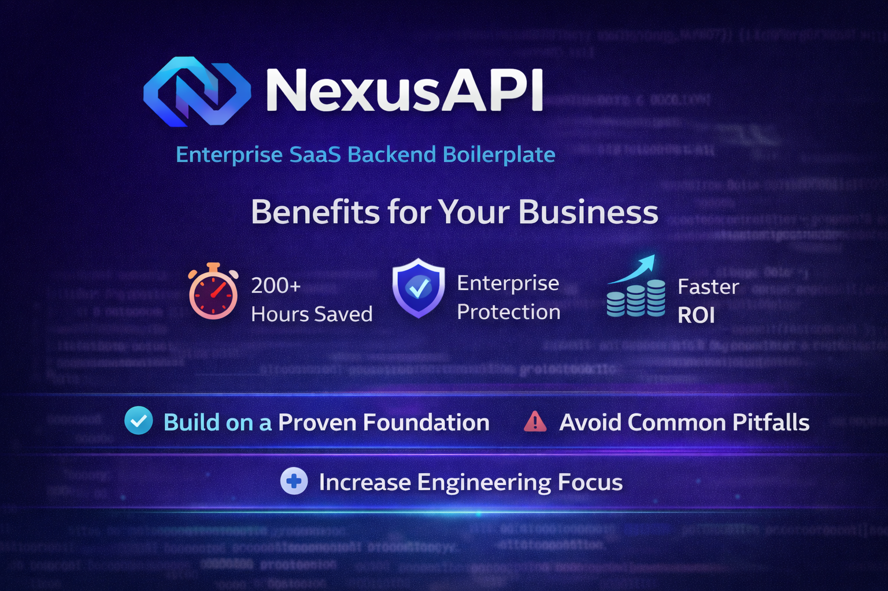
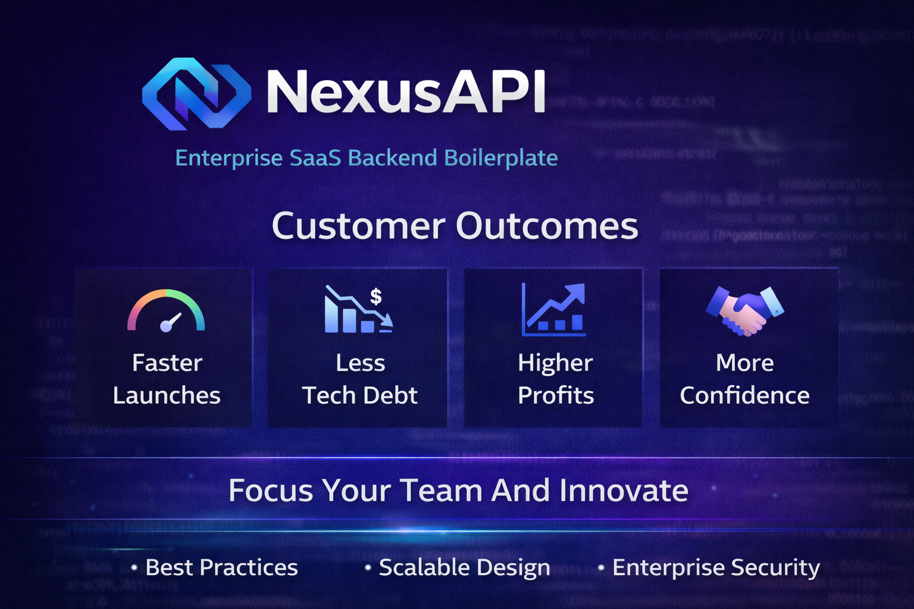

# 🏗️ NexusAPI Architecture & Visual Guide

This document provides visual representations of NexusAPI's architecture, components, and workflows.

---

## 📊 Architecture Overview



### System Architecture

NexusAPI follows a **clean architecture pattern** with clear separation of concerns:

- **Presentation Layer**: REST API controllers and Swagger documentation
- **Business Logic Layer**: Services and business rules
- **Data Access Layer**: Repositories and Prisma ORM
- **Infrastructure Layer**: External services and utilities

---

## 🏢 Multi-Tenancy Design



### Multi-Tenant Strategy

NexusAPI implements a **shared-database, shared-schema** approach:

- **Tenant Isolation**: Automatic tenant filtering via Prisma extensions
- **Request Context**: Tenant ID injection using CLS (Continuation-Local Storage)
- **Data Security**: Row-level security ensuring tenant data isolation
- **Scalability**: Cost-effective solution for SaaS applications

---

## 🔐 Authentication & Authorization



### Security Architecture

#### Dual-Token JWT System

- **Access Token**: 15-minute validity for API requests
- **Refresh Token**: 7-day validity for token renewal
- **Token Rotation**: Secure refresh with old token invalidation
- **Storage**: HttpOnly, secure cookies for XSS protection

#### Authorization Layers

1. **Role-Based Access Control (RBAC)**: USER, ADMIN, STAFF, MODERATOR
2. **Attribute-Based Access Control (ABAC)**: Fine-grained permissions with CASL
3. **Resource Ownership**: Users can only access their own resources
4. **Tenant Isolation**: Multi-tenant data separation

---

## 🛡️ Security Layers


### Comprehensive Security Implementation

#### Network Security

- **Helmet**: Security headers (CSP, HSTS, X-Frame-Options)
- **CORS**: Configurable cross-origin resource sharing
- **Rate Limiting**: Endpoint-specific protection (auth: 5/min, general: 100/min)

#### Application Security

- **Input Validation**: Comprehensive DTO validation with class-validator
- **Password Security**: Bcrypt with 12 rounds + complexity requirements
- **Email Enumeration Prevention**: Generic error messages for authentication
- **XSS Protection**: Content Security Policy and input sanitization

#### Data Security

- **Encryption**: Database connections and sensitive data
- **Audit Logging**: Complete activity tracking
- **Token Blacklisting**: Redis-based token invalidation
- **Environment Validation**: Joi-based configuration validation

---

## 📈 Performance Metrics


### Performance Optimization

#### Database Layer

- **Connection Pooling**: Efficient database connections
- **Query Optimization**: Eliminated N+1 problems
- **Indexing Strategy**: Optimized indexes for frequent queries
- **Read Replicas**: Support for read scaling

#### Caching Strategy

- **Multi-Layer Caching**: Redis with intelligent invalidation
- **Cache Warming**: Pre-load frequently accessed data
- **Performance Monitoring**: Track cache hit rates and response times
- **Background Processing**: BullMQ for async operations

#### Monitoring & Metrics

- **Response Time**: 50-200ms average (simple endpoints)
- **Throughput**: ~1200 RPS (optimized single instance)
- **Memory Usage**: ~200MB baseline
- **Cache Hit Rate**: 70-80%

---

## 🗄️ Database Schema



### Database Design

#### Core Entities

- **Users**: Authentication and profile management
- **Tenants**: Multi-tenant organization management
- **Profiles**: Extended user information
- **Audit Logs**: Activity and compliance tracking

#### Relationships

- **User-Tenant**: Many-to-one relationship for multi-tenancy
- **User-Profile**: One-to-one relationship for extended data
- **Audit-Tenant**: Audit logs scoped by tenant

#### Security Features

- **Soft Deletes**: Data retention with deletedAt timestamps
- **Row-Level Security**: Tenant-based data isolation
- **Audit Trails**: Complete activity logging
- **Indexing Strategy**: Optimized for performance

---

## 🌐 API Endpoints



### API Structure

#### Core Endpoints

```
Authentication:
POST /api/v1/auth/register    - User registration
POST /api/v1/auth/login       - User login
POST /api/v1/auth/refresh     - Token refresh
GET  /api/v1/auth/me          - Current user info

Users:
GET    /api/v1/users           - List users (paginated)
GET    /api/v1/users/:id       - Get user by ID
PATCH  /api/v1/users/:id       - Update user
DELETE /api/v1/users/:id       - Delete user

Health:
GET /api/health               - Health check
GET /api/health/liveness      - Liveness probe
GET /api/health/readiness     - Readiness probe
```

#### Features

- **Versioned API**: URI-based versioning (v1, v2)
- **Pagination**: Cursor-based pagination for large datasets
- **Filtering**: Advanced filtering capabilities
- **Sorting**: Multi-field sorting support
- **Field Selection**: Select specific fields to reduce payload

---

## 📊 Dashboard & Analytics



### Built-in Analytics

#### User Metrics

- **Active Users**: Real-time user counts
- **Registration Trends**: New user signups over time
- **User Engagement**: Activity and usage patterns
- **Geographic Distribution**: User locations and regions

#### System Metrics

- **Response Times**: API performance tracking
- **Error Rates**: Error monitoring and alerting
- **Resource Usage**: CPU, memory, and database metrics
- **Security Events**: Failed logins and suspicious activities

#### Business Intelligence

- **Tenant Analytics**: Per-tenant usage statistics
- **Feature Usage**: Which features are most used
- **Conversion Rates**: User journey and conversion tracking
- **Revenue Metrics**: If integrated with billing

---

## 🚀 Deployment Architecture



### Production Deployment

#### Container Orchestration

- **Docker**: Containerized application
- **Kubernetes**: Orchestration and scaling
- **Helm Charts**: Deployment templates
- **Service Mesh**: Istio for microservices communication

#### Infrastructure Components

- **Load Balancer**: Traffic distribution
- **API Gateway**: Centralized routing and security
- **Auto-scaling**: Horizontal pod autoscaling
- **Health Checks**: Liveness and readiness probes

#### Data Layer

- **PostgreSQL Cluster**: High availability database
- **Redis Cluster**: Distributed caching
- **Object Storage**: S3 for file management
- **Backup Strategy**: Automated backups and disaster recovery

---

## 📊 Key Performance Indicators

### Technical KPIs

- **Availability**: 99.9% uptime SLA
- **Response Time**: <200ms for 95th percentile
- **Error Rate**: <1% for all endpoints
- **Security**: Zero critical vulnerabilities

### Business KPIs

- **User Growth**: Monthly active users (MAU)
- **Feature Adoption**: Usage rates for new features
- **Performance Score**: Application performance index
- **Customer Satisfaction**: User feedback and ratings

---

## 🔄 Development Workflow

### Code Quality & Testing

- **Unit Tests**: 80%+ code coverage
- **Integration Tests**: API endpoint testing
- **E2E Tests**: Complete workflow testing
- **Security Tests**: Penetration testing and vulnerability scanning

### Continuous Integration/Deployment

- **GitHub Actions**: Automated CI/CD pipeline
- **Code Quality**: ESLint, Prettier, and TypeScript strict mode
- **Security Scanning**: Automated vulnerability detection
- **Deployment Staging**: Multi-environment deployment strategy

---

## 🔧 Configuration Management

### Environment Configuration

- **Development**: Local development settings
- **Staging**: Production-like environment for testing
- **Production**: Optimized production settings
- **Validation**: Joi-based environment validation

### Feature Flags

- **Feature Toggles**: Enable/disable features dynamically
- **A/B Testing**: Gradual feature rollout
- **Beta Programs**: Early access for new features
- **Configuration Updates**: Runtime configuration changes

---

## 📚 Additional Resources

### Documentation

- [API Documentation](../README.md) - Complete API reference
- [Security Guide](./SECURITY-HARDENING.md) - Security best practices
- [Performance Guide](./PERFORMANCE.md) - Optimization strategies
- [Deployment Guide](./deployment.md) - Production deployment

### Tools & Utilities

- [Postman Collection](../tools/postman/) - API testing collection
- [Docker Images](../docker/) - Container images and configurations
- [Monitoring](../monitoring/) - Grafana dashboards and alerts
- [Scripts](../scripts/) - Utility scripts and automation

---

_Architecture Guide Last Updated: February 5, 2026_
