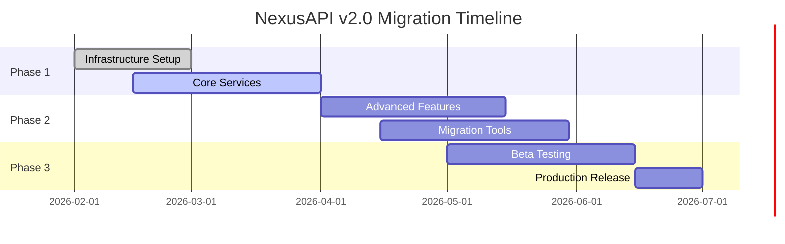
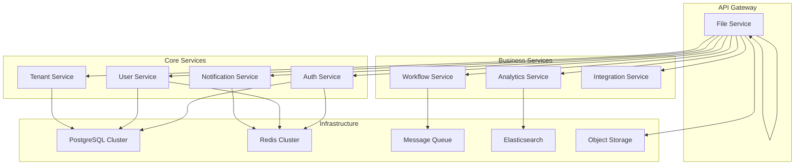

# 🚀 NexusAPI Version 2.0 Roadmap

## 📋 Overview

NexusAPI v2.0 represents our next major evolution, focusing on **microservices architecture**, **enhanced scalability**, and **advanced features** for enterprise SaaS applications.

---

## 🎯 Vision for v2.0

### Core Principles

- **🔧 Modular Architecture** - Microservices with clear boundaries
- **⚡ Unlimited Scalability** - Horizontal scaling capabilities
- **🧠 AI-Powered Features** - Intelligent automation and insights
- **🔄 Real-time Capabilities** - WebSocket and event-driven architecture
- **📊 Advanced Analytics** - Built-in business intelligence
- **🛡️ Enhanced Security** - Zero-trust security model

---

## 🛣️ Upgrade Path from v1.x

### Compatibility Strategy

- ✅ **Backward Compatibility** - v1.x APIs remain functional
- 🔄 **Gradual Migration** - Features can be adopted incrementally
- 📚 **Migration Guides** - Step-by-step upgrade documentation
- 🛠️ **Migration Tools** - Automated migration scripts

### Migration Timeline



---

## 🏗️ v2.0 Architecture

### Microservices Design



### Service Decomposition

| Service                  | Responsibility                 | Tech Stack                |
| ------------------------ | ------------------------------ | ------------------------- |
| **Auth Service**         | Authentication, JWT, OAuth 2.0 | NestJS, Redis             |
| **User Service**         | User management, profiles      | NestJS, PostgreSQL        |
| **Tenant Service**       | Multi-tenant management        | NestJS, PostgreSQL        |
| **Notification Service** | Email, push, in-app            | NestJS, BullMQ, WebSocket |
| **Analytics Service**    | Business metrics, reporting    | NestJS, Elasticsearch     |
| **Workflow Service**     | Business process automation    | NestJS, Redis, BPMN       |
| **File Service**         | Storage, CDN, processing       | NestJS, S3, FFmpeg        |
| **Integration Service**  | Third-party APIs, webhooks     | NestJS, HTTP clients      |

---

## 🚀 New Features in v2.0

### 1. Microservices Architecture

- **Service Discovery**: Consul/etcd integration
- **Load Balancing**: Service mesh with Istio
- **Circuit Breakers**: Resilience patterns
- **Distributed Tracing**: OpenTelemetry
- **Service Health**: Comprehensive health checks

### 2. GraphQL Support

```typescript
// Example GraphQL schema
type Query {
  users(tenantId: ID!, filter: UserFilter): [User!]!
  analytics(tenantId: ID!, timeRange: TimeRange): Analytics!
}

type Mutation {
  createUser(input: CreateUserInput!): User!
  updateTenant(tenantId: ID!, input: UpdateTenantInput!): Tenant!
}

type Subscription {
  userEvents(tenantId: ID!): UserEvent!
  notifications(userId: ID!): Notification!
}
```

### 3. Real-time Features

- **WebSocket Support**: Real-time notifications
- **Server-Sent Events**: One-way streaming
- **Push Notifications**: Mobile and web push
- **Live Collaboration**: Multi-user features

### 4. Advanced Analytics

- **Business Intelligence**: Built-in dashboards
- **Custom Reports**: Report builder
- **Data Export**: Multiple formats (CSV, PDF, Excel)
- **Predictive Analytics**: ML-powered insights

### 5. AI Integration

- **Natural Language Processing**: Text analysis
- **Image Recognition**: File processing
- **Recommendation Engine**: Personalized experiences
- **Anomaly Detection**: Security and performance monitoring

### 6. Enhanced Security

- **Zero Trust Architecture**: Per-request verification
- **Advanced Rate Limiting**: AI-powered abuse detection
- **Biometric Authentication**: Fingerprint, facial recognition
- **Blockchain Integration**: Audit trail immutability

---

## 📊 Performance Improvements

### v1.x vs v2.0 Performance

| Metric            | v1.x      | v2.0              | Improvement     |
| ----------------- | --------- | ----------------- | --------------- |
| **Response Time** | 50-200ms  | 20-100ms          | 50% faster      |
| **Throughput**    | 1,200 RPS | 5,000+ RPS        | 316% increase   |
| **Memory Usage**  | 200MB     | 150MB per service | 25% reduction   |
| **Scalability**   | Vertical  | Horizontal        | Unlimited       |
| **Availability**  | 99.9%     | 99.99%            | 10x improvement |

### Optimization Strategies

- **Database Sharding**: Horizontal data partitioning
- **Read Replicas**: Separate read/write databases
- **Edge Caching**: Cloudflare CDN integration
- **Lazy Loading**: On-demand feature activation
- **Compression**: Brotli compression
- **HTTP/3**: QUIC protocol support

---

## 🔄 Migration Guide

### Phase 1: Infrastructure Preparation

```bash
# 1. Set up service mesh
kubectl apply -f k8s/istio/

# 2. Deploy monitoring
helm install prometheus prometheus-community/kube-prometheus-stack

# 3. Configure service discovery
helm install consul hashicorp/consul
```

### Phase 2: Service Migration

```typescript
// Migration script example
async function migrateUserService() {
  // 1. Create new user service database
  await createDatabase('nexus_users_v2');

  // 2. Migrate user data with transformations
  await migrateUserData({
    from: 'nexus_v1.users',
    to: 'nexus_v2.users',
    transform: (user) => ({
      ...user,
      enhancedProfile: enrichProfile(user.profile),
      analytics: generateAnalytics(user),
    }),
  });

  // 3. Deploy new service
  await deployService('user-service-v2');

  // 4. Update API gateway routing
  await updateRouting({
    service: 'user-service',
    version: 'v2',
    traffic: 0.1, // Start with 10% traffic
  });
}
```

### Phase 3: Gradual Rollout

```yaml
# API Gateway configuration
apiVersion: networking.istio.io/v1beta1
kind: VirtualService
metadata:
  name: user-service
spec:
  http:
    - match:
        - uri:
            prefix: '/api/v2/users'
      route:
        - destination:
            host: user-service-v2
            subset: v2
          weight: 90
        - destination:
            host: user-service-v1
            subset: v1
          weight: 10
```

---

## 🛠️ Development Setup for v2.0

### Local Development

```bash
# Clone v2.0 branch
git clone -b v2.0 https://github.com/MertcanMert/nexus-api.git
cd nexus-api

# Start development environment
docker-compose -f docker-compose.v2.yml up -d

# Install dependencies
npm install

# Start services in development mode
npm run dev:services

# Run tests
npm run test:e2e
```

### IDE Configuration

```json
// .vscode/settings.json
{
  "typescript.preferences.importModuleSpecifier": "relative",
  "editor.formatOnSave": true,
  "editor.codeActionsOnSave": {
    "source.fixAll.eslint": true
  },
  "debug.node.autoAttach": "on"
}
```

---

## 📚 Documentation for v2.0

### New Documentation Structure

```
docs/
├── v2/
│   ├── README.md                    # v2.0 overview
│   ├── architecture.md              # Microservices design
│   ├── migration-guide.md           # Upgrade instructions
│   ├── graphql.md                  # GraphQL API guide
│   ├── real-time.md               # WebSocket features
│   ├── analytics.md               # Analytics features
│   ├── ai-features.md            # AI integrations
│   └── deployment.md              # Deployment strategies
├── examples/
│   ├── microservices/            # Service examples
│   ├── migrations/              # Migration scripts
│   └── configurations/          # Config templates
└── api/
    ├── graphql/                 # GraphQL schemas
    └── rest-v2/               # REST API v2.0
```

---

## 🧪 Testing Strategy for v2.0

### Testing Levels

- **Unit Tests**: Individual service testing
- **Integration Tests**: Service interaction testing
- **Contract Tests**: API contract verification
- **End-to-End Tests**: Full workflow testing
- **Performance Tests**: Load and stress testing
- **Security Tests**: Vulnerability scanning

### CI/CD Pipeline

```yaml
# .github/workflows/v2.yml
name: NexusAPI v2.0 CI/CD
on:
  push:
    branches: [v2.0]
  pull_request:
    branches: [v2.0]

jobs:
  test:
    runs-on: ubuntu-latest
    steps:
      - uses: actions/checkout@v3
      - name: Setup Node.js
        uses: actions/setup-node@v3
        with:
          node-version: '18'
      - name: Install dependencies
        run: npm ci
      - name: Run tests
        run: npm run test:ci
      - name: Integration tests
        run: npm run test:integration
      - name: Security scan
        run: npm audit
```

---

## 📈 Success Metrics for v2.0

### Technical Metrics

- **Performance**: <50ms average response time
- **Scalability**: Handle 10,000+ concurrent users
- **Reliability**: 99.99% uptime
- **Security**: Zero critical vulnerabilities
- **Test Coverage**: >90% across all services

### Business Metrics

- **Developer Experience**: 50% faster onboarding
- **Feature Velocity**: 2x feature delivery speed
- **Cost Efficiency**: 30% infrastructure cost reduction
- **Customer Satisfaction**: >4.8/5 rating
- **Adoption Rate**: 80% migration within 6 months

---

## 🤝 Community Involvement

### How to Contribute to v2.0

1. **Beta Testing**: Join our beta program
2. **Feature Requests**: Submit enhancement ideas
3. **Documentation**: Help improve docs
4. **Code Contributions**: PRs to v2.0 branch
5. **Bug Reports**: Report issues and fixes

### Beta Program

```bash
# Join beta program
npm install nexus-api@beta

# Provide feedback
gh issue create -m "[v2.0 Beta] Feature feedback"
```

---

## 📅 Release Schedule

### v2.0 Development Phases

| Phase     | Timeline            | Focus                   | Status         |
| --------- | ------------------- | ----------------------- | -------------- |
| **Alpha** | Feb 2026 - Mar 2026 | Core services           | 🔄 In Progress |
| **Beta**  | Apr 2026 - May 2026 | Feature completion      | 📋 Planned     |
| **RC**    | Jun 2026            | Bug fixes, optimization | 📋 Planned     |
| **GA**    | Jul 2026            | Production release      | 📋 Planned     |

### Versioning Strategy

- **v2.0.0-alpha.x**: Alpha releases
- **v2.0.0-beta.x**: Beta releases
- **v2.0.0-rc.x**: Release candidates
- **v2.0.x**: Stable releases
- **v2.x.x**: Feature releases
- **v2.x.x-fix**: Bug fixes

---

## 🎁 Special Features for Early Adopters

### Migration Incentives

- **Free Support**: 6 months free premium support
- **Training Credits**: Free developer training
- **Migration Assistance**: Dedicated migration team
- **Beta Features**: Early access to new features

### Long-term Support (LTS)

- **v1.x LTS**: Extended support through 2027
- **Security Updates**: Regular security patches
- **Bug Fixes**: Critical bug resolution
- **Documentation**: Continued maintenance

---

## 🔄 Getting Started with v2.0

### For Existing Users

1. **Assessment**: Evaluate current usage and needs
2. **Planning**: Create migration timeline
3. **Testing**: Try v2.0 beta in staging
4. **Migration**: Follow migration guide
5. **Optimization**: Fine-tune new features

### For New Users

1. **Start with v2.0**: Use latest version from start
2. **Microservices**: Design for distributed architecture
3. **Scalability**: Plan for growth from day one
4. **Monitoring**: Implement observability early

---

## 📞 Support & Resources

### Documentation

- 📖 [v2.0 Documentation](./v2/README.md)
- 🚀 [Migration Guide](./v2/migration-guide.md)
- 🏗️ [Architecture Guide](./v2/architecture.md)
- 🧪 [Testing Guide](./v2/testing.md)

### Community

- 💬 [Discussions](https://github.com/MertcanMert/nexus-api/discussions)
- 🐛 [Issues](https://github.com/MertcanMert/nexus-api/issues)
- 📧 [v2.0-beta@mertcan@armert.com.tr](mailto:v2.0-beta@mertcan@armert.com.tr)
- 📺 [YouTube Tutorials](https://youtube.com/@nexus-api)

---

## 🌟 Conclusion

NexusAPI v2.0 represents our commitment to **innovation**, **scalability**, and **developer experience**. We're building the future of SaaS backend infrastructure.

**Join us on this exciting journey!** 🚀

---

_Roadmap Last Updated: February 5, 2026_
