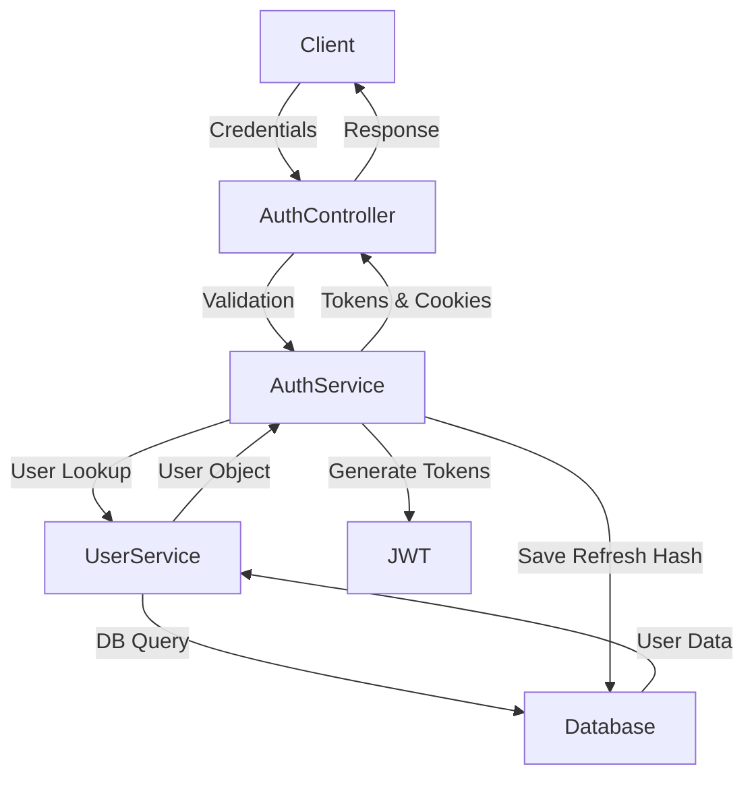

# 🔐 NexusAPI Authentication & Authorization System

[](https://nestjs.com/)
[](https://jwt.io/)
[](https://www.prisma.io/)

This document provides comprehensive documentation for the **Authentication and Authorization** infrastructure implemented in NexusAPI.

---

## 📋 Table of Contents

- [Architecture Overview](#-architecture-overview)
- [Authentication Flow](#-authentication-flow)
- [API Endpoints](#-api-endpoints)
- [Guards](#-guards)
- [Decorators](#-decorators)
- [DTOs](#-dtos)
- [Security Best Practices](#-security-best-practices)
- [Error Responses](#-error-responses)
- [Configuration](#-configuration)

---

## 🏗 Architecture Overview

The authentication system is built on **JWT (JSON Web Tokens)** with a dual-token strategy:

| Token Type | Purpose | Expiration | Storage |
|------------|---------|------------|---------|
| **Access Token** | API authentication | 15 minutes | Client memory & HttpOnly Cookie |
| **Refresh Token** | Token renewal | 7 days | Database (hashed) & HttpOnly Cookie |

### Core Components

```
┌─────────────────────────────────────────────────────────────────┐
│                        NexusAPI Auth System                      │
├─────────────────────────────────────────────────────────────────┤
│                                                                  │
│  ┌──────────────┐  ┌──────────────┐  ┌──────────────────────┐   │
│  │ AuthService  │  │ JwtStrategy  │  │ JwtRefreshStrategy   │   │
│  │              │  │              │  │                      │   │
│  │ - login()    │  │ - validate() │  │ - validate()         │   │
│  │ - refresh()  │  │              │  │ - passReqToCallback  │   │
│  │ - validate() │  │              │  │                      │   │
│  └──────────────┘  └──────────────┘  └──────────────────────┘   │
│                                                                  │
│  ┌──────────────┐  ┌──────────────┐  ┌──────────────────────┐   │
│  │ JwtAuthGuard │  │  RoleGuard   │  │   OwnershipGuard     │   │
│  │              │  │              │  │                      │   │
│  │ Auth Check   │  │  RBAC Check  │  │  Resource Ownership  │   │
│  └──────────────┘  └──────────────┘  └──────────────────────┘   │
│                                                                  │
└─────────────────────────────────────────────────────────────────┘
```

### Request Flow



---

## 🔄 Authentication Flow

### 1. User Login

1.  Client sends credentials to `POST /auth/login`.
2.  `AuthService` validates email and password (bcrypt).
3.  If valid, `AuthService` generates Access (15m) and Refresh (7d) tokens.
4.  **Tenant ID** is embedded into the JWT payload.
5.  Refresh token is hashed and saved to the database.
6.  Tokens are returned in the response body AND set as **HTTP-Only Cookies**.

### 2. Token Refresh

1.  Client requests `POST /auth/refresh`.
2.  Can provide Refresh Token by `Authorization: Bearer <token>` header OR `refresh_token` cookie.
3.  Server validates the token hash against the database.
4.  If valid, rotates the refresh token (generates a new pair) and updates cookies.

---

## 📡 API Endpoints

### `POST /api/v1/auth/login`

Authenticates a user and returns JWT tokens.

**Request:**
```bash
curl -X POST http://localhost:3000/api/v1/auth/login \
  -H "Content-Type: application/json" \
  -d '{"email": "user@example.com", "password": "SecurePass123!"}'
```

**Success Response (200):**
```json
{
  "success": true,
  "statusCode": 200,
  "meta": {
    "path": "/api/v1/auth/login",
    "method": "POST",
    "message": "Request successful",
    "timestamp": "2026-02-04T01:50:00.000Z"
  },
  "data": {
    "access_token": "eyJhbGciOiJIUz...",
    "refresh_token": "eyJhbGciOiJIUz..."
  }
}
```

**Cookies Set:**
* `access_token`: HttpOnly, Secure (Prod), SameSite=Strict
* `refresh_token`: HttpOnly, Secure (Prod), SameSite=Strict

---

### `POST /api/v1/auth/refresh`

Refreshes the access token.

**Request:**
```bash
# Using Header
curl -X POST http://localhost:3000/api/v1/auth/refresh \
  -H "Authorization: Bearer <REFRESH_TOKEN>"

# Using Cookie (Automatic in Browser)
curl -X POST http://localhost:3000/api/v1/auth/refresh -b "refresh_token=..."
```

**Success Response (200):**
Returns new token pair.

---

### `GET /api/v1/auth/me`

Returns the authenticated user's information.

**Request:**
```bash
curl -X GET http://localhost:3000/api/v1/auth/me \
  -H "Authorization: Bearer <ACCESS_TOKEN>"
```

**Success Response (200):**
```json
{
  "userId": "123e4567-e89b-12d3-a456-426614174000",
  "email": "user@example.com",
  "role": "USER",
  "tenantId": "tenant-uuid-..."
}
```

---

## 🛡 Guards

### JwtAuthGuard

Validates the JWT access token and injects the authenticated user into `request.user`.

**Usage:**
```typescript
@UseGuards(JwtAuthGuard)
@Get('profile')
getProfile(@Request() req) {
  return req.user;
}
```

### RoleGuard

Enforces Role-Based Access Control (RBAC).

**Usage:**
```typescript
@UseGuards(JwtAuthGuard, RoleGuard)
@Roles(Role.ADMIN)
@Get('admin-dashboard')
getAdminDashboard() {}
```

### OwnershipGuard

Restricts access to the resource owner or an admin.

**Usage:**
```typescript
@UseGuards(JwtAuthGuard, OwnershipGuard)
@Put(':id')
updateUser(@Param('id') id: string) {}
```

---

## 🎨 Decorators

### @CurrentUser

Provides clean access to the authenticated user.

```typescript
@Get('me')
getMe(@CurrentUser() user) { return user; }
```

### @Roles

Defines role requirements.

```typescript
@Roles(Role.ADMIN, Role.MODERATOR)
```

---

## 📦 DTOs

### LoginDTO
- `email`: Valid email format.
- `password`: Min 8 chars.

### PayloadDTO
JWT Payload structure:
```typescript
{
    id: string;
    email: string;
    role: Role;
    tenantId: string;
}
```

---

## 🔒 Security Best Practices

1.  **HttpOnly Cookies:** Prevents XSS attacks from stealing tokens.
2.  **Rotation:** Refresh tokens are one-time use.
3.  **Hashing:** Refresh tokens are hashed in the DB.

---

## ❌ Error Responses

```json
{
  "success": false,
  "statusCode": 401,
  "meta": {
    "message": "Invalid credentials!",
    "timestamp": "..."
  }
}
```

## ⚙️ Configuration

| Variable | Description |
|----------|-------------|
| `JWT_SECRET` | Secret for Access Token |
| `JWT_REFRESH_SECRET` | Secret for Refresh Token |

---

<div align="center">
  <sub>Built with ❤️ using NestJS & Senior Engineering Standards</sub>
</div>