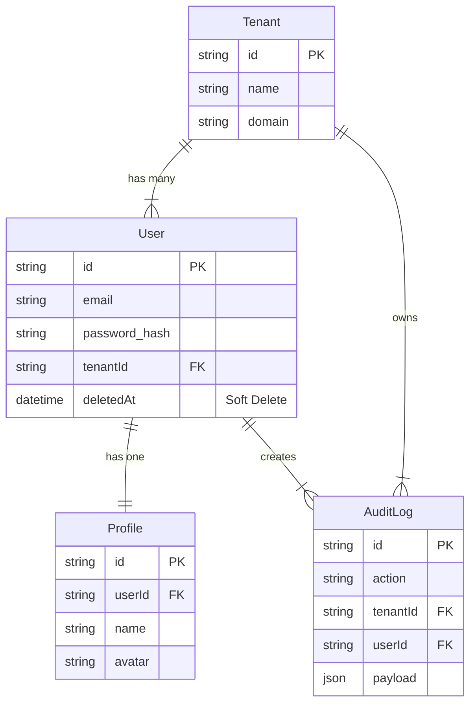

# 🗄 Database Architecture (Prisma)

[](https://nestjs.com/)
[](https://www.prisma.io/)
[](https://www.postgresql.org/)

This document details the database schema, relationships, and the automated migration workflow.

---

## 📋 Table of Contents

- [ER Diagram concept](#-er-diagram-concept)
- [Entities](#-entities)
- [Relationships](#-relationships)
- [Migrations & Workflow](#-migrations--workflow)

---

## 📊 ER Diagram Concept

The database follows a **Star Schema** variant centered around the `Tenant`.



---

## 🧱 Entities

### `Tenant` (`tenants`)
The root organization unit.
- **Key Fields:** `id` (UUID), `name`, `domain` (Unique).
- **Purpose:** Data isolation boundary.

### `User` (`users`)
Authenticatable entities.
- **Key Fields:** `email` (Unique per tenant context), `password`, `role` (Enum), `deletedAt`.
- **Constraint:** A user belongs to exactly one tenant.

### `Profile` (`profiles`)
Extended user information purely for display purposes.
- **Key Fields:** `name`, `lastName`, `bio`, `avatar` (URL).

### `AuditLog` (`audit_logs`)
Immutable record of system activities.
- **Key Fields:** `action`, `resource`, `ipAddress`, `payload` (JSONB).

---

## 🔗 Relationships

1. **One-to-One:** `User` ↔ `Profile`
   - Enforced by Foreign Key on `Profile`.
   - Cascade Delete: Deleting a User deletes the Profile.

2. **One-to-Many:** `Tenant` ↔ `User`
   - A Tenant has many Users.

3. **One-to-Many:** `User` ↔ `AuditLog`
   - A User generates many Audit Logs.
   - **No Cascade:** Deleting a User keeps their Audit Logs for security history (`SetNull` or keep ID).

---

## 🚀 Migrations & Workflow

We use **Prisma Migrate** to manage schema changes.

### 1. Modifying Schema
Edit `prisma/schema.prisma`.

### 2. Creating Migration
Generate SQL files from your schema changes:
```bash
npx prisma migrate dev --name <descriptive-name>
# Example: npx prisma migrate dev --name add_profile_bio
```

### 3. Applying to Production
Safe for CI/CD pipelines:
```bash
npx prisma migrate deploy
```

---

<div align="center">
  <sub>Built with ❤️ using NestJS & Senior Engineering Standards</sub>
</div>
