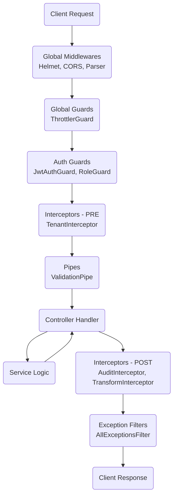

# 🔄 Request Lifecycle (The Pipeline)

Understanding the order of execution is critical for debugging and security. This document outlines the exact path an HTTP request takes through the NexusAPI infrastructure.

---

## 📋 Table of Contents

- [The Pipeline Diagram](#-the-pipeline-diagram)
- [Step-by-Step Execution](#-step-by-step-execution)
- [Global vs Route Scoped](#-global-vs-route-scoped)

---

## 🌊 The Pipeline Diagram

---

## 👣 Step-by-Step Execution

### 1. Incoming Request
The request hits the server. **Middlewares** like `helmet` (Security Headers) and `cls-rtracer` (Request ID) run first.

### 2. Guards (Authorization)
Before any logic runs, Guards verify if the request is allowed.
1. **ThrottlerGuard:** Is the IP rate-limited?
2. **JwtAuthGuard:** Is the token valid?
3. **RoleGuard:** Does the user have the right Role?
4. **PoliciesGuard:** Does the user have granulary CASL permission?

*If any Guard returns `false`, the request stops immediately with 401/403.*

### 3. Interceptors (Pre-Controller)
1. **TenantInterceptor:** Extracts `tenantId` from User and saves it to CLS context. This ensures all subsequent DB queries are isolated.

### 4. Pipes (Validation)
**ValidationPipe** checks the DTO. If the JSON body uses strings where numbers are expected, or misses required fields, it throws 400 Bad Request. The Controller is never executed.

### 5. Controller & Service
The actual business logic runs. The Service communicates with the Database (Prisma) or Queues (BullMQ).

### 6. Interceptors (Post-Controller)
1. **AuditInterceptor:** If the methods was POST/PUT/DELETE, it captures the result and sends it to the Audit Log Queue.
2. **TransformInterceptor:** Wraps the return value in the standard `{ success: true, data: ... }` format.

### 7. Exception Filters
If *anything* goes wrong at *any* step, **AllExceptionsFilter** catches the error, formats it nicely, and sends a JSON response.

---

  Built with ❤️ using NestJS & Senior Engineering Standards

